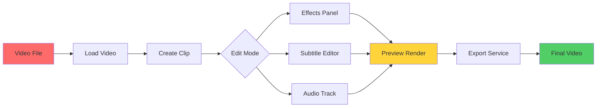
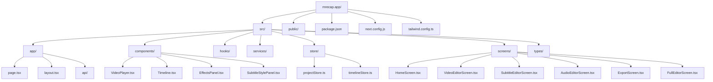
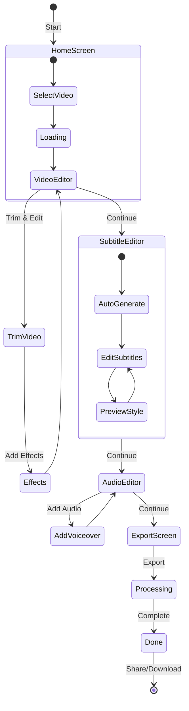

# 🎬 MRecap - Video Recap Editor

<p align="center">
  
</p>
)
<p align="center">
  <strong>Transform Your Videos into Captivating Recaps</strong><br/>
  Automatic subtitles • Voiceover • Professional Effects • PWA Support
</p>

<p align="center">
  <a href="https://github.com/amkyawdev/mrecap.app">
    
  </a>
  <a href="https://github.com/amkyawdev/mrecap.app/blob/main/LICENSE">
    
  </a>
  <a href="https://github.com/amkyawdev/mrecap.app">
    
  </a>
</p>

[ဒီမှာ Demo ကြည့်ရန်](https://mrecap-app.vercel.app) 👈
---

## 📖 Table of Contents

- [Overview](#-overview)
- [Features](#-features)
- [Architecture](#architecture)
- [Technology Stack](#technology-stack)
- [Getting Started](#getting-started)
- [Project Structure](#project-structure)
- [Workflow](#workflow)
- [API Reference](#api-reference)
- [Contributing](#contributing)
- [License](#license)

---

## 🔍 Overview

MRecap is a **Progressive Web App (PWA)** for creating professional video recaps with minimal effort.

### What Can MRecap Do?

```
┌─────────────────────────────────────────────────────────────────┐
│                        INPUT                                    │
│  ┌──────────────┐  ┌──────────────┐  ┌──────────────────────┐  │
│  │   VIDEO      │  │   VOICEOVER  │  │   SUBTITLES (SRT)    │  │
│  │   Files      │  │   Audio      │  │   Auto-generated     │  │
│  └──────────────┘  └──────────────┘  └──────────────────────┘  │
└─────────────────────────────────────────────────────────────────┘
                              │
                              ▼
┌─────────────────────────────────────────────────────────────────┐
│                     PROCESSING                                   │
│  ┌──────────────────────────────────────────────────────────┐   │
│  │  • Video Trimming & Cropping                              │   │
│  │  • Audio Mixing (Original + Voiceover)                   │   │
│  │  • Subtitle Rendering (Burned into video)                │   │
│  │  • Video Effects (Filters, Rotation, Speed)                │   │
│  │  • Real-time Preview                                      │   │
│  └──────────────────────────────────────────────────────────┘   │
└─────────────────────────────────────────────────────────────────┘
                              │
                              ▼
┌─────────────────────────────────────────────────────────────────┐
│                        OUTPUT                                   │
│  ┌──────────────┐  ┌──────────────┐  ┌──────────────────────┐  │
│  │   EXPORTED   │  │   SHARE     │  │   DOWNLOAD           │  │
│  │   MP4        │  │   Native    │  │   Save to Device     │  │
│  └──────────────┘  └──────────────┘  └──────────────────────┘  │
└─────────────────────────────────────────────────────────────────┘
```

---

## ✨ Features

### Core Features

| Feature | Description |
|---------|-------------|
| 📹 **Video Upload** | Support for MP4, MOV, WebM video formats |
| 🎤 **Voiceover** | Add background music or narration |
| 📝 **Auto Subtitles** | AI-powered subtitle generation |
| ✏️ **Subtitle Editor** | Fine-tune subtitle timing and text |
| 🎨 **Video Effects** | Filters, brightness, contrast, saturation |
| 🔄 **Transform** | Rotation, flip, speed control |
| 📤 **Export** | High-quality MP4 output |
| 📱 **PWA Support** | Works offline, add to home screen |

### Video Effects Available

- **Color Filters**: Vintage, Cool, Warm, Dramatic, B&W, Sepia
- **Quick Effects**: Blur, Sharpen, Grayscale
- **Transform**: Rotate (90°/180°/270°), Flip H/V
- **Speed Control**: 0.25x to 4x playback speed

---

## 🏗️ Architecture

### System Architecture

```mermaid
flowchart TB
    subgraph Client["Frontend Client"]
        UI[Next.js 14 UI]
        State[Zustand State Management]
        Store1[projectStore<br/>subtitles, style]
        Store2[timelineStore<br/>videoClips, effects]
    end
    
    subgraph Services["Processing Services"]
        Export1[FFmpeg.wasm<br/>Client-side]
        Export2[Server Export<br/>Docker/Node]
    end
    
    subgraph API["API Routes"]
        Route1[/api/export]
        Route2[/api/upload]
    end
    
    UI --> State
    State --> Store1
    State --> Store2
    Store2 --> Export1
    Store2 --> Export2
    Store1 --> Route1
    UI --> Route1
```

### Data Flow



---

## 🛠️ Technology Stack

### Frontend

| Technology | Purpose | Version |
|------------|---------|---------|
| **Next.js 14** | React Framework | ^14.0.0 |
| **TypeScript** | Type Safety | ^5.0.0 |
| **Tailwind CSS** | Styling | ^3.4.0 |
| **Zustand** | State Management | ^4.4.0 |
| **Lucide React** | Icons | ^0.294.0 |

### Video Processing

| Technology | Purpose | Version |
|------------|---------|---------|
| **@ffmpeg/ffmpeg** | Client-side FFmpeg | ^0.12.0 |
| **@ffmpeg/util** | FFmpeg Utilities | ^0.12.0 |

### Development

| Technology | Purpose |
|------------|---------|
| **pnpm** | Package Manager |
| **ESLint** | Linting |
| **Prettier** | Code Formatting |

---

## 🚀 Getting Started

### Prerequisites

- Node.js 18+ 
- pnpm 8+
- Git

### Installation

```bash
# Clone the repository
git clone https://github.com/amkyawdev/mrecap.app.git
cd mrecap.app

# Install dependencies
pnpm install

# Start development server
pnpm dev
```

### Build for Production

```bash
# Build the application
pnpm build

# Start production server
pnpm start
```

---

## 📁 Project Structure



### Key Files

| File | Description |
|------|-------------|
| `src/screens/*.tsx` | Main application screens |
| `src/components/*.tsx` | Reusable UI components |
| `src/hooks/*.ts` | Custom React hooks |
| `src/store/*.ts` | Zustand state stores |
| `src/services/*.ts` | Export and API services |

---

## 🔄 Workflow

### Editor Workflow



### Screen Navigation

```mermaid
flowchart LR
    A[Home] --> B[Video Editor]
    B --> C[Subtitle Editor]
    C --> D[Audio Editor]
    D --> E[Export]
    
    E --> A: Restart
    E --> D: Back
    
    style A fill:#ff6b6b
    style B fill:#ffa94d
    style C fill:#ffd43b
    style D fill:#69db7c
    style E fill:#4dabf7
```

---

## 🔌 API Reference

### Export API

```
POST /api/export
Content-Type: multipart/form-data
```

#### Request Parameters

| Field | Type | Required | Description |
|-------|------|----------|-------------|
| `video` | File | ✅ | Video file (MP4, MOV, WebM) |
| `subtitle` | string | ❌ | SRT format subtitles |
| `audio` | File | ❌ | Voiceover/Old audio file |
| `audioVolume` | number | ❌ | Voiceover volume (0-1) |
| `effects` | JSON | ❌ | Array of video effects |
| `filter` | JSON | ❌ | Color filter settings |
| `rotation` | number | ❌ | Rotation angle (0, 90, 180, 270) |
| `flipH` | boolean | ❌ | Horizontal flip |
| `flipV` | boolean | ❌ | Vertical flip |
| `speed` | number | ❌ | Playback speed (0.25-4) |

#### Response

```json
{
  "status": 200,
  "Content-Type": "video/mp4",
  "Content-Disposition": "attachment; filename=\"mrecap-export.mp4\""
}
```

#### Example (cURL)

```bash
curl -X POST http://localhost:3000/api/export \
  -F "video=@video.mp4" \
  -F "subtitle=$(cat subtitles.srt)" \
  -F "rotation=90" \
  -F "speed=1.5" \
  -o output.mp4
```

---

## 👥 Contributing

Contributions are welcome! Please follow these steps:

1. **Fork** the repository
2. **Create** your feature branch (`git checkout -b feature/amazing-feature`)
3. **Commit** your changes (`git commit -m 'Add amazing feature'`)
4. **Push** to the branch (`git push origin feature/amazing-feature`)
5. **Open** a Pull Request

### Development Guidelines

- Use TypeScript for type safety
- Follow existing code style
- Add comments for complex logic
- Write tests for new features
- Update documentation

---

## 📄 License

This project is licensed under the MIT License - see the [LICENSE](LICENSE) file for details.

---

## 🙏 Acknowledgments

- [FFmpeg](https://ffmpeg.org/) - Video processing
- [Zustand](https://zustand-demo.pmnd.rs/) - State management
- [Tailwind CSS](https://tailwindcss.com/) - Styling
- [Lucide](https://lucide.dev/) - Icons
- [Next.js](https://nextjs.org/) - Framework

---

## 📞 Contact

- **GitHub**: [@amkyawdev](https://github.com/amkyawdev)

---

<p align="center">
  <strong>Made with ❤️ for content creators</strong>
</p>
